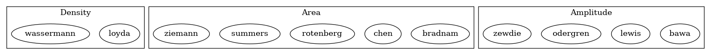

Algorithms
----------
.. 
  .. graphviz:: classes.dot
    :name: dependencies
    :layout: dot

Sorted in alphabetical order according to last name of first author.

Suitable algorithms were deteced based on a literature research on pubmed using *ipsilateral motor evoked potentials* as keyword. This search was performed on 5th October 2020. Articles were selected based on title and abstract, and the subselected manuscripts were read for sufficient description of an automated algorithms for estimation of iMEP amplitude (or area, or similar). All algorithms have been implemented to the best of our understanding, based on the description of methods in the respective paper. 

In the description of some algorithms, minor details were missing, e.g., the
duration of the post TMS search window. In these cases, sensible defaults were
used, and documented to inform the user. Decisions and quotes from the 
respective papers can be found in the source code of the respective functions 
for reference

.. currentmodule:: dimep.algo

Chen 2003
+++++++++

.. autofunction:: chen

Bawa 2004
+++++++++

.. autofunction::  bawa
   
Bradnam 2010
++++++++++++

.. autofunction:: bradnam
   
   
Guggenberger
++++++++++++

.. autofunction:: guggenberger
   
Lewis 2007
++++++++++

.. autofunction:: lewis

Loyda 2017
++++++++++

.. autofunction:: loyda

Odergren 1996
+++++++++++++

.. autofunction:: odergren

Rotenberg 2010
++++++++++++++

.. autofunction:: rotenberg

Summers 2020
+++++++++++++

.. autofunction:: summers

Wassermann 1994
+++++++++++++++

.. autofunction:: wassermann

Zewdie 2017
+++++++++++

.. autofunction:: zewdie

Ziemann 1999
++++++++++++

.. autofunction:: ziemann