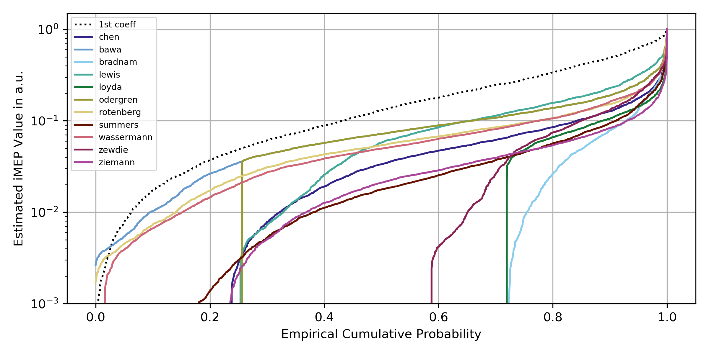
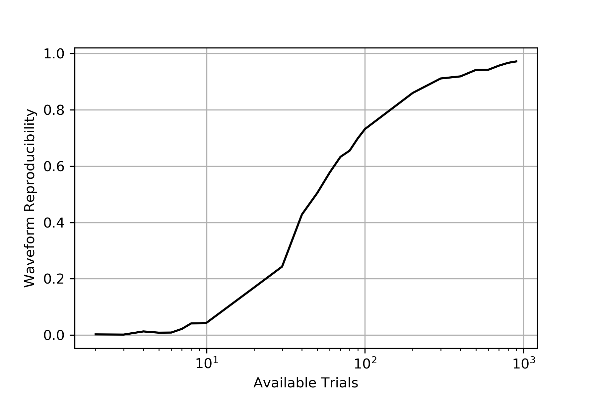

Evaluation
----------

We assessed these algorithms on a dataset of 2546 trials from 54 subjects aggregated from a series of our own studies.  You can find the results in the accompanying manuscript (to be submitted).

Strictness
----------

One of the findings was that very strict threshold-based approaches like Bradnam or Loyda are better able to recover the latent waveform, but at the cost of a low reliability, as many trials can not be measured and are assigned as zero. This asssignment of zeros can be interpreted as strictness, and can be estimated by plotting the empirical CDF

Decomposition Saturation
------------------------

An alternative to template or threshold-based approaches is a direct decomposition, e.g. with a PCA. We ran a simulation, and it would require around 1000 trials for the decomposition to reach saturation, i.e. that two scores are sufficiently similar in shape. 

